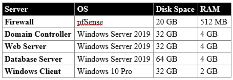

# Hyper-V Homelab Configuration:

Domain: AD.SMHCOMPUTERS.COM

Internal Adapter: Internal DNS Resolution - Static - Priority on WB/DC/Client

External Adapter: External DNS Resolution - DHCP - Priority on DC

Default Gateway: 10.0.0.1 - IP of Internal Switch

# VMs:

# VM Specifications:

